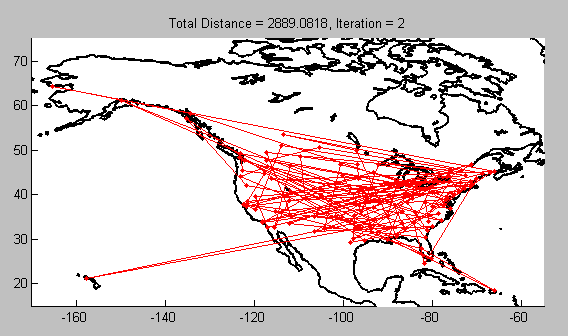

# Traveling Salesman Problem Using Genetic Algorithm

This GitHub repository contains a Python implementation of solving the Traveling Salesman Problem (TSP) using a genetic algorithm. The algorithm aims to find an optimal route for a salesman to visit a set of cities exactly once and return to the starting city while minimizing the total distance traveled.

## Algorithm Overview

### Importing Libraries

Several Python libraries are used in this implementation:

- `numpy`: For numerical operations.
- `pandas`: For data handling.
- `matplotlib`: For visualization.
- `more_itertools`: For additional iterator tools.

These libraries are essential for handling data, performing genetic operations, and visualizing results.

### Reading Input File

The input file containing information about cities and distances is read and processed to create a matrix representing the distances between cities.

### Fitness Function

A fitness function calculates the total distance traveled along a route represented by a chromosome. This function is crucial for evaluating the quality of potential solutions.

### Creating the Initial Society

A population of random routes (chromosomes) is created. The population size is determined by the 'population' parameter. The initial population represents different possible solutions to the TSP.

### Selecting Parents for Crossover

Parents for crossover are selected from the current population using the truncation selection method. 'T' determines the percentage of the population to consider, and 'N' is the number of parents selected. This step helps in generating new solutions by combining the genetic material of parents.

### Crossover

The order recombination method is used to create new child chromosomes from selected parents. It involves inheriting a portion of one parent's genes and completing the route with the genes from the other parent. This step creates diverse offspring.

### Mutation

Mutation introduces diversity into the population by making small changes to some of the children's chromosomes. In this implementation, mutation involves mirroring a portion of the chromosome.

### Evolution Loop

The genetic algorithm iterates for a specified number of generations (100 in this case). In each iteration, it performs selection, crossover, mutation, and updates the population. The mean and minimum fitness values are calculated and stored to monitor the algorithm's progress.

##Inputs
The input file containing information about cities and distances is read and processed to create a matrix representing the distances between cities.(Input examples can be found in HW1.pdf)

### Results

The best chromosome (route) found by the algorithm and its fitness (total distance) are displayed as the result. This represents the optimized solution to the TSP.

## Parameters Used

- **Population**: The number of individuals (routes) in the population.
- **N (Parent Selection)**: The number of parents selected for crossover in each generation.
- **T (Parent Selection)**: The percentage of the population from which parents are selected.
- **Child Number**: The number of children generated in each generation.
- **Child Percentage (Mutation)**: The percentage of children subjected to mutation.

These parameters control various aspects of the genetic algorithm's behavior, such as the size of the population, how parents are selected for reproduction, and the rate of mutation in the offspring. Adjusting these parameters can impact the algorithm's performance and the quality of the solutions it produces.

## Running the Code

To run this code, you need to provide an input file (e.g., "bayg29.tsp") containing city coordinates and distances. Make sure to set the parameters according to your problem requirements. The genetic algorithm will iteratively optimize the TSP route.

## Visualization

The code also provides a simple visualization of the mean and minimum fitness values over generations to monitor the algorithm's progress.

